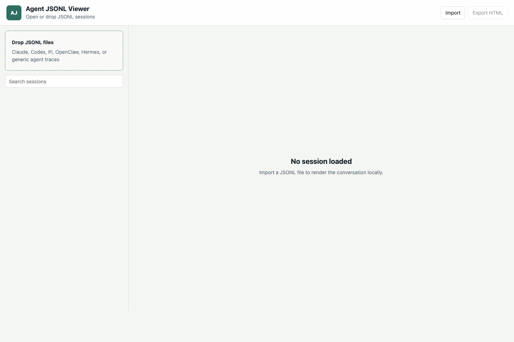

# Agent JSONL Viewer

Live app: https://honghua.github.io/agent-jsonl-export/

A local-first viewer for agent session JSONL files from Claude, Codex, Pi Agent, OpenClaw, Hermes, and similar harnesses.

## Web UI

Open the live app or `index.html`, then import or drop one or more `.jsonl` files. The viewer renders sessions locally in your browser with message search, role filtering, raw JSON blocks, and standalone HTML export.

Files are parsed in the browser and are not uploaded.

## Python CLI

`python3 agent_jsonl_export.py --source /path/to/session-or-folder --output exports/agent-html`
